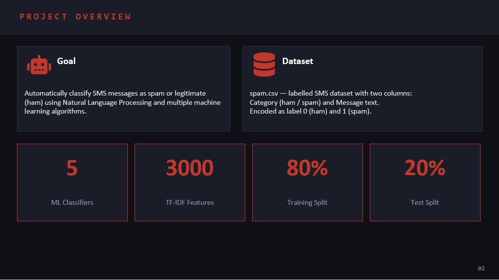
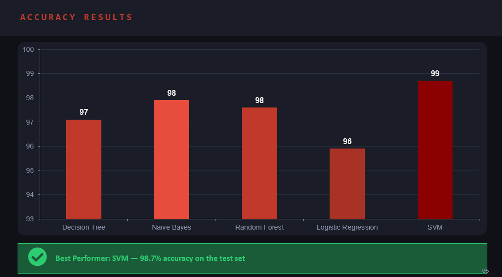
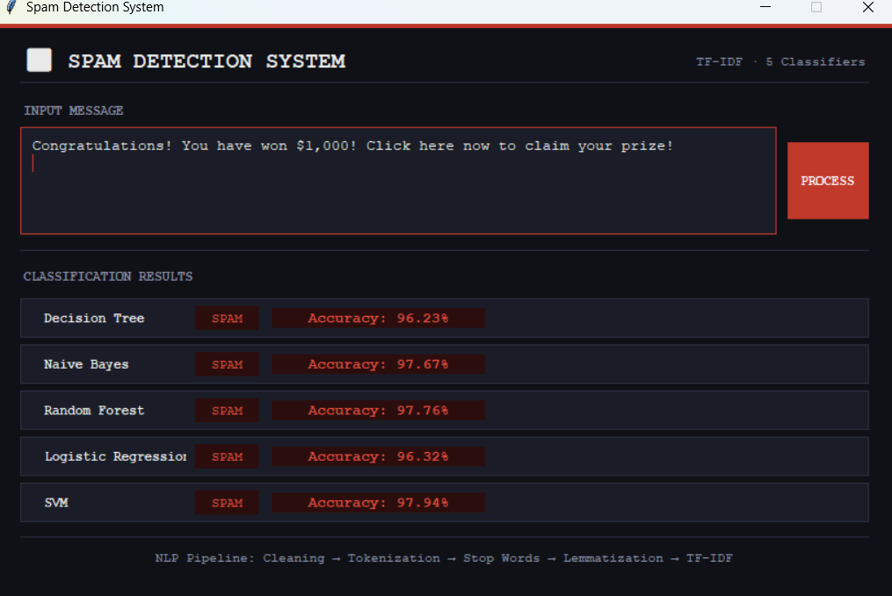
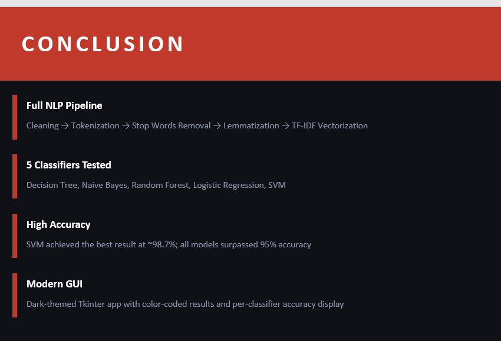

# Spam Email Detection System

A machine learning-based spam email detection system that uses Natural Language Processing (NLP) and compares five different machine learning classifiers.

## Features

- Complete NLP preprocessing pipeline
- TF-IDF feature extraction
- Comparison of 5 machine learning classifiers
- Interactive Tkinter GUI
- Color-coded spam/ham results
- Per-classifier accuracy display

## NLP Pipeline

The text is processed through the following steps:

Cleaning → Tokenization → Stop Words Removal → Lemmatization → TF-IDF Vectorization

## Machine Learning Classifiers

The project compares:

1. Decision Tree
2. Naive Bayes
3. Random Forest
4. Logistic Regression
5. Support Vector Machine (SVM)

## Results

SVM achieved approximately **98.7% accuracy**, while all five tested models achieved more than **95% accuracy** on the evaluation dataset.

## Technologies

- Python
- Scikit-learn
- NLTK
- Pandas
- NumPy
- Tkinter
- TF-IDF

## Graphical User Interface

The project includes a dark-themed Tkinter interface that allows users to classify emails and view the results from the different machine learning classifiers.
## Project Overview

## Machine Learning Classifiers

## Results

## GUI

## Conclusion

